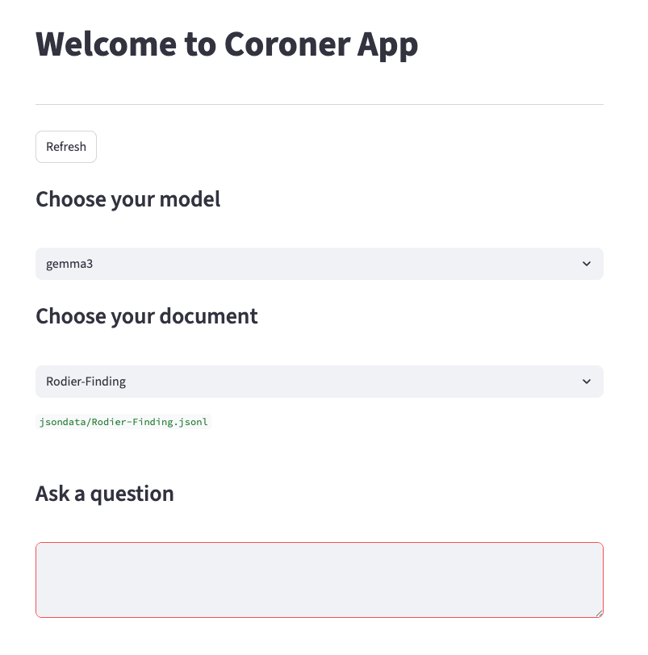

# Coroner Project

The coroner project is a Retrieval Augmented Generation (RAG) system for interacting with coroner's reports. The idea is to be able to get quick and factually accurate answers to questions about the content of the reports.


## Setup

Setting up all the dependencies and the environment is somewhat complex and will take quite a while, so please make sure you have the time to sit down and go through everything carefully.

### Ollama

First you'll need to install the ollama model server so that we can locally interact with the various LLMs we'll be using. You can download and install ollama from [here](https://ollama.com/).

We'll be using at least three different generative LLM models in addition to the embedding model for the vector database so you'll need to pull these models from the ollama catalog to your local machine. Once you have ollama installed and running you can start by installing the embedding model.

**NB** Once installed you can type `ollama` at the terminal to see some help info.

### Embedding Model

The embedding model we are using is [mxbai-embed-large](https://ollama.com/library/mxbai-embed-large). To install it you can use the following command:

`ollama pull mxbai-embed-large`

Once it's installed use the `ollama list` command. You should see some details about the model in the terminal.

### LLM Llama 3.2

All the LLM models we'll be using can be found [here](https://github.com/ollama/ollama/blob/main/README.md#model-library). Take note of the size of the models and the RAM requirements. The first one you'll need to install is [llama3.2](https://ollama.com/library/llama3.2) (2.0 GB) which can be installed with the following command:

`ollama pull llama3.2`

### LLM gemma3

Next install [gemma3](https://ollama.com/library/gemma3) (3.3 GB) with this command:

`ollama pull gemma3`

### LLM phi4-mini

Now install [phi4-mini](https://ollama.com/library/phi4-mini) (2.5 GB) with this command:

`ollama pull phi4-mini`

### Conda Environment

If you have the ollama model server correctly setup and have installed all the models you can next create the Python environment with conda. If you don't already have conda installed you can follow the instructions [here](https://docs.conda.io/projects/conda/en/latest/user-guide/install/index.html).

Once conda is up and running you'll need to create the environment for our project which has all the dependencies whithin it. To do so, open up a terminal and type the following command:

`conda env create -f environment.yml`

**NB** You'll need to be in the main directory of this repo for the command to work because that is where the `environment.yml` file is located. See [here](https://docs.conda.io/projects/conda/en/latest/user-guide/tasks/manage-environments.html#creating-an-environment-from-an-environment-yml-file) for more details. If you've done everything correctly you should now be able to enter the environment by typing `conda activate coroner_env`.

## Start Chatting

If you have successfully set up the environment you should now be able to start the application. Again, make sure you are in the main directory of this repo and you have the `coroner_env` conda environment running. You can begin an interactive chat session in two ways, via the terminal with `chat.py` or from the locally hosted web app `app.py`.

To start the terminal chat simply type `python chat.py` and you should be able to start chatting with one of the documents (it'll take a little while to boot the first time). 

The documents have a `.jsonl` extension because they have already been through the preprocessor. This makes loading the vector database more efficient.

Here is an example interaction:

```
you@computer coroner % conda activate coroner_env
(coroner_env) you@computer coroner % python chat.py

Available LLMs:

  1. phi4-mini
  2. gemma3
  3. llama3.2

Enter the number of the LLM you want to use: 2

Available files:

  1. TAULELEI-Jacob-Finding.jsonl
  2. Rodier-Finding.jsonl
  3. Blood-results-redacted.jsonl
  4. Forkin-finding-2014.jsonl
  5. Baby-H-finding.jsonl
  6. Nicholls-Diver-finding.jsonl

Enter the number of the file you want to use: 2

Initializing, please wait...

Loading jsondata/Rodier-Finding.jsonl

LLM & vector store ready.

Starting chat.


--------------------------------------------------------------------------------


Ask your question (type q to quit):


```

If you have a list of pre-prepared questions in, for example, a CSV file, then you might like to use `chat_extended.py` which has an extension module that, given a file containing a list of questions, automates the question answering for you and saves the results to a file.

**NB** On some Windows terminals the HTTP requests to the local Ollama server may appear on `stdout`.

To launch the web app, in your terminal, type `streamlit run app.py` and you'll see a chat interface like this:



The webapp will _hot reload_ the system for seamless testing of the same question with different generative models and/or different documents.


## Programmatic Interaction

To use the RAG system from within an ordinary Python script take a look at the demo modules (`demo.py` or `demo.ipynb`) where you'll find examples of how to use the `qanda.py` module for programmatic interaction.


## Preprocessing your Documents

If you have a new PDF document you'd like to work with you'll need to preprocess it. To invoke the preprocessor on your document simply add the document to the `data/` directory and then run `python preprocessor.py`. The resulting processed JSONL file will appear in the `jsondata/` directory.


## Data

The coroner's reports (and other such documents) used for the project were supplied by Dr. Matt Albrecht from the [Western Australian Centre for Road Safety Research (WACRSR)](https://www.uwa.edu.au/projects/centre-for-road-safety-research/wacrsr-site-link).


## Evaluations

In the `evaluations/` directory you'll find a curated collection of questions and answers along with scores (i.e., scored with [Bert Score](https://arxiv.org/abs/1904.09675)) for each of the documents and generative LLM models.


## Report

A summary and data files associated with the project report can be found in the `report/` directory.

