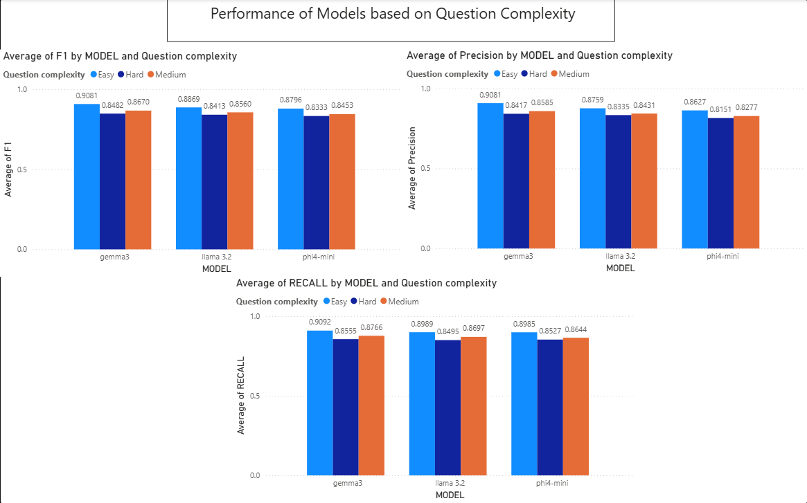

# Report

# Summary of Model Evaluation Results

This folder contains the detailed results and visualizations from our comparative analysis of three Large Language Models (LLMs) for automated data extraction from coroners' reports. The models tested were Gemma3 , Llama3.2 (8B), and Phi-4 Mini.

To evaluate the models evaluation a sophisticated methodology based on BERT scores (F1, Precision, Recall) was used to measure the semantic similarity between model-generated answers and a manually created "ground truth" dataset.

# Key Findings:

Overall Best Performer: The Gemma3 model achieved the highest overall average BERT F1-Score of 0.9092, making it as the most effective and well-balanced model for the general task.

# Performance by Task:

Gemma3 really excelled at direct factual extraction from general coroners' reports, achieving the average F1-Score of 0.9081 on "Easy" questions, 0.9081 on "Medium" questions and 0.9092 on "Hard" questions.

Llama 3.2 performed really advantage during the data-intensive tasks on blood/chemical analysis results report.

Performance vs. Model Size: An important insight was that model performance is not purely a function of size. The Llama3.2 model frequently outperformed the larger Phi-4 mini model, suggesting that model architecture and training play a crucial role.

Identified Limitation: A qualitative review revealed a common weakness across all models: source-answer misalignment. Models sometimes provided a correct answer but cited an incorrect passage from the report. This highlights a key area for future improvement in ensuring the reliability and verifiability of the system's outputs.

For a detailed breakdown of the metrics and visualizations, please refer to the main project report and the Power BI file.
